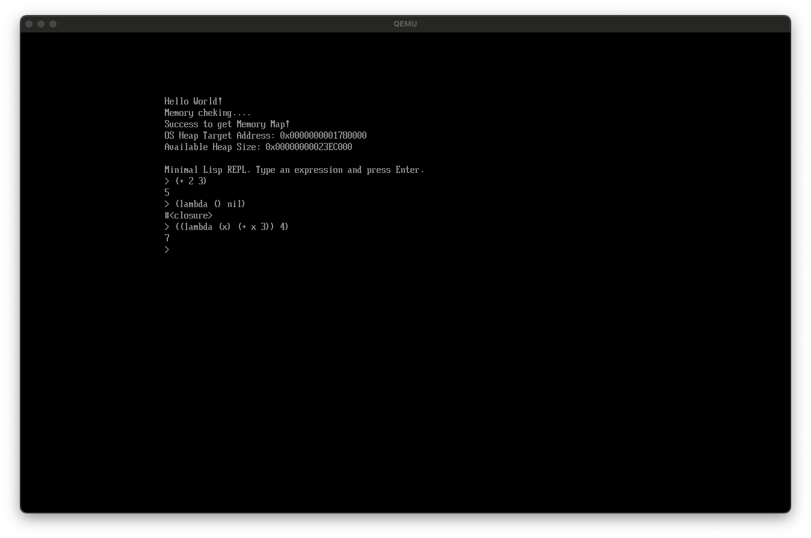
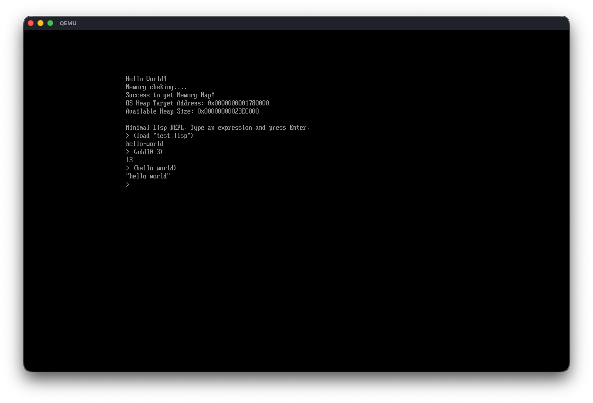

# os-boot-dev

フリースタンディングCでスクラッチから書く、UEFIブートローダー兼ミニマムなLisp OSです。
PE32+実行ファイル（`BOOTX64.EFI`）としてビルドし、QEMU/OVMF上で動作します。

## このプロジェクトについて

- 現代的なx86_64、UEFIの構成のPCでbootするOSを書いてみる
- UEFIの提供する機能をふんだんに使い、どのくらいラクにつくれるのかを試してみる
- インタラクティブなシェルとしてのLispを実装する

UEFIの型・構造体・プロトコルはいったん手書きでやってます。
目的はモダンなOSがどうやって起動するのかを一から学ぶことです。

## 現在の状態

UEFIから起動し、自己ホスティングされた標準ライブラリを持つLisp REPLが立ち上がります。
`defun`・`defmacro`・動的スコープ変数・非局所脱出（`block`/`return-from`）・エラー時の
REPL自動復旧・数値タワー（fixnum/bignum/float）・文字列/ベクタ型・パッケージ・
マーク＆スイープGCまで実装済みで、トップレベルの評価はLisp自身で書かれたコンパイラ＋
スタックマシン型バイトコードVMが既定の経路になっています（`defmacro`とrest-arg形式の
`defun`のみ、従来のツリーウォーク評価器へフォールバックします）。

- UEFIブート・Hello World・メモリマップ取得によるヒープ確保
- タグ付きポインタ方式のLispオブジェクトシステム（cons・fixnum・bignum・float・symbol・
  string・vector・closure）とマーク＆スイープGC（ヒープ残量が少なくなると自動発火、
  `(gc)`で手動起動も可能）
- S式のリーダー／プリンター（`'`/`` ` ``/`,`/`,@`の糖衣構文、文字列リテラル、コメント
  `;`に対応）
- レキシカルスコープを持つ評価器（`quote`/`quasiquote`/`if`/`lambda`/`defun`/`defmacro`/
  `let`/`let*`/`progn`/`setq`/`cond`/`and`/`or`/`when`/`unless`/`block`/`return-from`）と
  `defvar`/`defparameter`による動的スコープ変数
- 自作`setjmp`/`longjmp`を使ったエラー復旧: 評価中に`panic`が起きてもREPLの入力待ちへ
  自動的に戻る（致命的なリソース枯渇時のみ本当に停止する）
- `car`/`cdr`/`cons`/`eq`/`atom`/`+`/`-`/`<`などの組み込みプリミティブに加え、
  `list`/`append`/`reverse`/`mapcar`/`nth`/比較演算子/`gensym`/`macroexpand-1`/
  `rplaca`/`rplacd`/`make-vector`/`svref`/`svset`/`hash-code`/`sleep`など
- パッケージシステム（`LispPackage`の登録APIとシンボルのパッケージ帰属）
- `EFI_SIMPLE_FILE_SYSTEM_PROTOCOL`/`EFI_FILE_PROTOCOL`を使い、FAT32のESP上のLispファイルを
  `(load "filename")`で読み込み・評価。`(write-file "filename" content)`でESPへの書き込みも
  できる（QEMUの`fat:rw:`ドライバは書き込みコミットが不安定なため、実機や生ディスクイメージ
  向けの機能として位置づけ）
- `(write-line "text")`でシリアルコンソールへ直接1行出力できる。これを使い、
  ブート時に`EFI/BOOT/BOOTX64.EFI`と同じディレクトリの`init.lisp`があれば
  stdlib読込・自己テストの直後、REPL開始前に自動で読み込んで評価する（無ければ何もしない）。
  テスト用のLispコードと`write-line`によるPASS/FAIL出力を`init.lisp`に置いておくだけで、
  対話操作なしにQEMUのシリアル出力を見る（または`-serial file:...`でログに落として`grep`
  する）だけでユニットテストの結果が分かる
- 起動時に`lisp/compiler.lisp`（コンパイラ本体、コンパイラ準備状態フラグが立つ前提として
  ツリーウォークで読み込む）→`lisp/stdlib.lisp`（標準的な関数・マクロ、以後はコンパイル
  経由で読み込む）の順に自動で`load`し、標準ライブラリをLisp自身で定義した状態でREPLが
  起動する（自己ホスティング）
- スタックマシン型バイトコードVM（`vm-exec`）とLisp自身で書かれたコンパイラ
  （`lisp/compiler.lisp`の`compile-expr`系関数、クロージャ・upvalue・関数呼び出しに対応）が
  トップレベル評価・`defun`本体のコンパイルの既定経路になっている。グローバル参照は
  実行時にシンボル同一性で再解決されるため、`defun`同士の前方参照・相互再帰は従来の
  ツリーウォーク評価器と同じ挙動を保つ





詳細なマイルストーンは以下の15ドキュメントにまとめています。1〜67まで全て完了済みです。

- [`documents/boot.md`](documents/boot.md)（1〜11: UEFIブート〜最小Lisp REPL）
- [`documents/init_lisp.md`](documents/init_lisp.md)（12〜16: `defun`〜`load`）
- [`documents/bare_metal_lisp.md`](documents/bare_metal_lisp.md)（17〜29: CommonLisp相当を
  目指す拡張、標準ライブラリの自己ホスティングまで）
- [`documents/lisp_robustness.md`](documents/lisp_robustness.md)（30〜33: 自作setjmp/longjmp
  によるエラー復旧とマーク＆スイープGC）
- [`documents/lisp_vm.md`](documents/lisp_vm.md)（34〜46: スタックマシン型VM＋Lisp自身による
  コンパイラ）
- [`documents/lisp_vm_integration.md`](documents/lisp_vm_integration.md)（48〜67: VM/コンパイラを
  既定の評価器に統合するロードマップ）
- [`documents/lisp_package_system.md`](documents/lisp_package_system.md)（68〜87: パッケージ
  システムをCommonLispサブセットへ再設計するロードマップ、68〜70,72〜84,87完了（フェーズA〜F・
  Hが完了）・85〜86未着手。78で発見したVM/コンパイラの非tail位置let系スタックリークのうち
  `progn`は78で修正済み、`let`/`let*`/`or`側の根本修正はローカル変数領域とオペランドスタックの
  分離という設計で83〜84として完了した。81着手時に発見した、
  `*package*`切替後は`common-lisp-user`の特殊形式・ビルトインが無修飾で使えなくなる制約の解消は
  85〜86として追加。フェーズH（87）はA〜Gと無関係な内容（コンパイラ自身の自己ブートストラップ関数
  の`do`/`while`化によるCスタック深度対策）だが、マイルストーン番号のグローバル連番管理を優先し
  本ドキュメントへ追記した）
- [`documents/lisp_lambda_list_keywords.md`](documents/lisp_lambda_list_keywords.md)（89:
  CommonLisp相当のラムダリストキーワード`&optional`/`&rest`/`&key`/`&aux`/`&allow-other-keys`の
  導入、完了。VM/バイトコードには手を入れずツリーウォークインタプリタのみを拡張し、コンパイル済み
  コードに直接ネストした`lambda`での使用は安全のため`lisp_panic`する設計）
- [`documents/lisp_variadic_comparison_operators.md`](documents/lisp_variadic_comparison_operators.md)
  （90: 比較演算子`>`/`=`/`<=`/`>=`/`/=`のCommonLisp相当の可変長引数対応、完了。`<`自体は
  milestone29から可変長対応済みで、89で導入した`&rest`を使いstdlib.lisp側の残り5演算子を
  書き換えた）
- [`documents/lisp_package_operations.md`](documents/lisp_package_operations.md)（91〜92:
  パッケージ指定子のsymbol/keyword対応、`do-symbols`系マクロ・`package-name`/`find-symbol`等の
  読み取り系関数、`shadow`/`import`/`delete-package`/`rename-package`等の破壊的操作系関数と
  `defpackage`の`:shadow`/`:import-from`/`:shadowing-import-from`句の追加、完了）
- [`documents/lisp2_conversion.md`](documents/lisp2_conversion.md)（93〜95: Lisp-1(Scheme相当の
  単一名前空間)からLisp-2(CommonLisp相当の変数/関数の名前空間分離)への移行、完了。93で
  シンボルへ関数セルを追加し`symbol-function`/`fboundp`/`#'`等のAPIを整備、94で`defun`・
  組み込み関数・呼び出し位置解決・コンパイラ・VM・ブートストラップを1マイルストーンとして一括で
  切り替え、95で既存コードの`#'`/`funcall`化を仕上げた）
- [`documents/lisp_clos.md`](documents/lisp_clos.md)（96〜97: CommonLisp Object System(CLOS)の
  最小サブセット導入、完了。96で`defclass`/`make-instance`/`slot-value`と単一継承を
  `LispClosure`の既存エスケープハッチパターンで実装、97で`defmethod`が暗黙生成する総称関数
  （Lisp-2化後の規約により対象symbolの関数セルへ格納）と、単一継承下での複数引数
  multiple dispatch（specificityの部分順序比較による`lisp_gf_select_method`）を追加した）
- [`documents/lisp_print_object.md`](documents/lisp_print_object.md)（98〜99: printerの
  未対応種別を解消するマイルストーン、完了。98で`print-object`をLisp拡張可能な総称関数として
  導入し（`defmethod print-object`でオーバーライド可能）、instanceの印字をこれに委譲。文字列
  連結プリミティブが無いためmethod本体がコンソールへ直接書き込む設計とし、新規ビルトイン
  `write-string`/`princ`を追加した。99でpackage（`#<PACKAGE name>`）とcompiled-function
  （`#<COMPILED-FUNCTION>`）の専用印字分岐を追加した。両者はCLOSのspecializerがユーザー
  定義クラスのみという制約(97)によりdefmethodでは上書きできない、class/instance/
  generic-functionと同じ非拡張パターンで実装した）
- [`documents/lisp_os_process.md`](documents/lisp_os_process.md)（100〜118: マルチプロセス化を
  最終目標としたロードマップ、100〜118完了。`process`クラス（CLOS）・
  `os:*all-processes*`レジストリ・`make-process`によるプロセス毎の隔離パッケージ生成
  （ベースパッケージ`common-lisp-user`を`use-package`し、fork側は`shadow`でローカル再定義）・
  `lock-package`によるベースパッケージロック・`process-suspend`/`process-resume`/
  `process-local-variable`・安全なリモートインスペクタREPL・Ctrl2回連続押下によるプロセス
  切替UIを対象とする。フェーズA（100・101）は`lisp_package_system.md`の旧85・86番
  （*package*切替時の特殊形式/ビルトイン可視性問題）を統合した前提条件フェーズ。100で
  `defun`/`if`/`let`等の特殊形式ディスパッチシンボル・`t`・`&optional`等のラムダリスト
  キーワードを`common-lisp-user`からexportし、`*package*`切替＋`use-package`済みなら
  無修飾で特殊形式が使えるようにした。101では`LISP_REGISTER_BUILTIN`マクロ自体を
  自動export経由に置き換え、`car`/`cons`/`in-package`等の全ビルトイン関数も同様に
  無修飾で使えるようにした。102では新規`os`パッケージ（`process`/`*all-processes*`/
  `get-all-processes`をexport）を`lisp/os-package.lisp`で作成し、続く`lisp/os.lisp`で
  `defclass os:process`（スロット`name`/`package`/`stackframe`/`env`/`status`、
  スロット名自体は`common-lisp-user`所属のまま）・`os:*all-processes*`・
  `os:get-all-processes`を定義した。`compiler.lisp`/`stdlib.lisp`と同様2ファイルに
  分割したのは、`load`がファイル全体を読み切ってから評価するため同一ファイル内では
  `defpackage`の効果が後続フォームの読み取りに反映されない制約を回避するため。103では
  Cビルトイン`%make-process`（`%make-class`と同じCビルトイン+薄いLispラッパーの
  パターン）を実装し、`os:make-process`（`&optional name`）から呼ぶようにした。名前
  省略時はgensymと同じカウンタ方式で`PROCESS-<N>`形式の一意名を生成し、ユーザー指定名は
  `os:*all-processes*`内の既存名と内容が一致すると`lisp_panic`する（文字列内容比較は
  str_data直接アクセスが必要でLisp側に無いため）。104ではper-processスタック領域と
  コンテキスト保存構造`LispProcessStack`を追加した。`lisp_process_stack_create`が
  `AllocatePages`で新規スタック領域を確保し、既存の`lisp_setjmp`/`lisp_longjmp`
  （milestone30、`jmpq`ベースで戻り先を問わない）を新規アセンブラ無しに再利用する形で、
  「未開始」コンテキスト（偽装した`rsp`/`rip`でトランポリン関数へ着地）と「開始済み」
  コンテキスト（前回の中断点から再開）の双方を扱える`lisp_context_switch(from, to)`を
  実装した。main/別スタックコンテキスト間で3往復するC自己テストで確認した。105では
  `LispProcessStack`へ`vm_stack`/`vm_sp`/`active_trap`の3フィールドを追加した。
  `src/lisp.c`側の同名グローバル（`vm_stack`/`vm_sp`/`lisp_active_trap`）は「今実行中の
  プロセスのもの」を指す単一の作業領域のまま変更せず（`lisp_vm_run`等は無変更）、
  `lisp_context_switch`が切替の都度、現在のグローバルの内容をfromへ退避してからtoに
  保存されていた内容をグローバルへ復元するようにした。別スタック上のコンテキストの
  開始直後にmain側の値・トラップが一切見えないこと、逆にmain側がbの実行によって
  書き換えられないこと、bを再度resumeすると自分専用の値・トラップがそのまま残っている
  ことをC自己テストで確認した。106では`lisp_vm_run`のVM命令ディスパッチループ先頭に
  毎命令チェックするyieldフックを追加した。新規グローバル`lisp_vm_current_process`/
  `lisp_vm_yield_target`（デフォルトNULL）の両方が非NULLの時のみ武装され、
  `lisp_vm_yield_budget`が0に達した時点で`lisp_vm_current_process`から
  `lisp_vm_yield_target`へ`lisp_context_switch`する（104/105の状態退避にそのまま
  相乗りするため`lisp_vm_run`自体は無変更）。デフォルト（両方NULL）では既存の全実行
  経路の挙動は変化しない。C自己テストでは0からTARGETまで数え上げる手書きbytecodeを
  小さいquantumで複数回中断・再開させ、1回の切替では完了しないこと（真に複数回
  yield・resumeされたこと）と、最終的に正しい結果まで数え上げを完了すること（pc・
  オペランドスタック・ローカル変数がyieldを跨いで保持されること）を確認した。
  yieldチェックは`lisp_vm_run`（コンパイル済みbytecode経路）内のみのスコープであり、
  ツリーウォーク経路（`lisp_eval`/`lisp_apply`）は対象外のまま残る。107では
  `lisp_process_stack_register`/`lisp_process_stack_unregister`を新設し、中断中の他プロセスを
  `lisp_gc_mark_roots`のルート集合へ明示的に登録・解除できるようにした（milestone87の
  `lisp_gc_extra_root`と同じ手動登録パターン）。登録済み各プロセスの`LispProcessStack.vm_stack
  [0..vm_sp)`を、今実行中のプロセスのグローバル`vm_stack`マーキングに加えてマークするように
  `lisp_gc_mark_roots`を拡張した。C自己テストでは、別スタック上のプロセスがそのプロセス専用の
  `vm_stack`にのみpushしたconsが、中断後に`(gc)`相当を実行しても回収されず、その後大量のダミー
  consでフリーリスト再利用を強制しても内容が保持されることを確認した（milestone34の単一プロセス
  版`lisp_vm_gc_root_selftest`の複数プロセス拡張）。ロードマップが要求する「GC発火条件を
  全プロセスが安全点にいる時のみに拡張する」という点は、現状GCがREPLループ先頭または`(gc)`
  呼び出し時という「実行中プロセス自身の安全地点」でしか発火せず、他の全プロセスはyieldチェック
  設計上常に命令境界で中断している（安全点以外で中断する経路が無い）ため、新たな判定コードを
  追加せず既存設計により構造的に満たされていると判断した。108では`%make-process`
  （`os:make-process`の実体）を拡張し、fork時に一意名の隔離パッケージを自動生成するように
  した。`lisp_make_package`は同名パッケージが既に存在すると黙って既存を返す（fork時の一意性
  保証には使えない）ため、新規`lisp_make_package_strict`（名前衝突時に共有せずpanicする作成
  経路）を追加した。パッケージ名は新規カウンタ`lisp_fork_package_name_counter`から
  `FORK-PKG-<N>`形式で生成する（既存のプロセス名生成`PROCESS-<N>`とは別カウンタ・別接頭辞の
  ため互いに衝突しない）。生成したパッケージへ既存の`use-package`ビルトインで
  `common-lisp-user`をuseし、`process`インスタンスの`package`スロット（102で新設・以前は
  常にnil）へ格納する。C自己テストでは、生成されたパッケージがnilでないこと・2回連続fork
  したパッケージ名が異なること・`common-lisp-user`をuseしていること・fork先パッケージ内で
  無修飾internした`car`が`common-lisp-user`の`car`と`eq`であること（ベースパッケージへの
  委譲が実際に機能していること）を確認した。109は`shadow`（milestone92で実装済み）を使い、
  fork側パッケージ内にベースと同名だが別オブジェクトの新規シンボルを確保してローカルな
  再定義を行う手順を確立した。実際の運用手順（`in-package`で切替→`shadow`で確保→
  `defun`で再定義）はREPL/`load`が1トップレベルフォームずつread→evalを繰り返すことに
  支えられているため、1つのテスト関数の本体にそのまま書くと内側の`car`という無修飾トークンは
  本体全体がcommon-lisp-userのまま1度に読み切られる際に結局common-lisp-userの`car`として
  読まれてしまう（milestone79/81のreader可視性制約と対称の問題）。そのためテストでは実際の
  再定義自体を`%set-symbol-function`（milestone93）で行い、`shadow`で確保したシンボルは
  `intern`（文字列引数、ランタイムに`*package*`へ対して解決される）経由で取得することで
  この制約を回避しつつ、`in-package`/`shadow`の実行自体は手順どおりに踏襲した。fork側の`car`
  シンボルがベースと`eq`でないこと・fork側で再定義した関数が新しい結果を返すこと・ベース側の
  `car`が無傷のままであること・復帰後の`common-lisp-user`での`intern`結果が変わらないことを
  確認した。110ではパッケージ(`LispClosure`のescape hatch実装)へ新規`pkg_locked`フィールドを
  追加し、`lock-package`/`unlock-package`（フラグの立て下げ、designatorはパッケージ本体/
  文字列/symbol/keywordいずれも可）・`package-locked-p`（読み取り）の3ビルトインを追加した。
  書込サイトへのロックチェック自体はmilestone111のスコープであり、本マイルストーンではフラグの
  読み書きのみを実装した。111では実際のロックチェックを書込サイトへ追加し、起動時に
  `common-lisp-user`をデフォルトでロックした。ロードマップ原文の「ロック中パッケージへの書込を
  禁止する」を素朴に適用すると、既存テストフィクスチャの新規`defun`まで壊れるため、
  「新規シンボルへの初回定義は常に許可し、既に確立済みの束縛（関数セル`fn`が非nil、または
  動的変数`is_special`が真）を上書きする場合のみ、そのシンボルのホームパッケージ（呼び出し時の
  `*package*`ではなく`sym->package`）がロック済みならpanicする」という"redefinition-only"
  セマンティクスを採用した。ツリーウォーク`defun`・コンパイル済み`defun`経由の
  `establish-global-function`・`%set-symbol-function`は「`fn`が既に非nilかつロック済み」、
  ツリーウォーク`defparameter`とコンパイル済み`defparameter`/`defvar`が共通で呼ぶ
  `establish-special`は「上書き前の`is_special`が真かつロック済み」を判定条件とした。`defvar`
  自体は既存の非対称な条件分岐（milestone18、既にis_specialなら上書きしない）により構造的に
  既存束縛を上書きできないため変更不要。一方`setq`/`lisp_env_set`は、ロードマップが書込サイトの
  一つとして挙げていたにもかかわらず、意図的にチェック対象外とした。`setq`は「既に確立済みの
  変数の値を書き換える」通常の実行時操作であり定義操作ではなく（CommonLisp/SBCLの
  package lockも同様に対象外）、チェックを入れると`let`による動的変数の再束縛・代入という
  正常動作（`test-dynamic-vars.lisp`の既存テストが検証している挙動）まで塞いでしまうため。
  `lisp_lock_cl_user_package`を`main.c`の起動シーケンス末尾（全boot fileのロード・全C自己テスト
  完了後、`lisp_load_init_file`直前）から呼ぶことで、milestone81の自己テスト等、起動処理自体が
  行う`common-lisp-user`内の再定義はロックの影響を受けないようにした。既存テストのうち
  `common-lisp-user`上で意図的に既存定義を上書きしていた3箇所（`test-dynamic-vars.lisp`の
  defparameter上書きテスト・`test-compile-and-run.lisp`の同種テスト・`test-symbol-function.lisp`
  の関数再定義テスト）は、上書き前後を`unlock-package`/`lock-package`で挟むよう修正した。
  ロック中に既存定義を再定義してpanicするシナリオ自体は検証方針どおり`make test`では検証せず、
  個別のQEMU対話セッション（`(defun car (x) 'oops)`が`"Lisp panic: Package is locked"`で
  panicし、REPLが復帰後も`car`が無傷であることを確認）で確認した。112では
  フェーズC（104〜107）のコンテキスト切替機構を使い、`os:process`インスタンスに実際の
  実行機構（`%process-resume`/`%process-suspend`、`os:process-resume`/`os:process-suspend`
  として`os`パッケージからexport）を与えた。`stackframe`スロット（以前は常にnil）を
  固定長16件のコンテキストプール内のindex（fixnum）として再利用し、未起動プロセスは
  `&optional thunk`（0引数のLisp関数）で新規開始、起動済みプロセスは直前の
  `process-suspend`の中断点から再開する。`process-suspend`は「今実際に実行中の
  コンテキスト自身」からのみ許可される自己suspend専用設計（他プロセスの強制停止は
  不可）。単一実行コンテキストの協調的切替である以上、`process-resume`の呼び出し元が
  制御を取り戻した時点で観測できる`status`は常に`:suspended`か`:finished`のいずれかで
  あり、`:active`を外部から観測することは原理的にできないという不変条件を確認した
  （当初この不変条件に反する`:active`を自己テストで直接アサートしてしまい、恒久的に
  FAILし続けるバグを起こした後に修正）。ツリーウォーク経路（`lisp_eval`/`lisp_apply`）の
  C局所変数はmilestone107のGCルート集合の対象外のままである既知の制約は、スコープ内の
  未解消リスクとして明記した。113では`%process-local-variable(process symbol)`を実装し、
  `os:process-local-variable`としてexportした。`process`の`env`スロット（以前は常にnil）へ、
  `%process-resume`の初回起動時にthunkクロージャ自身の`env`フィールド（生成時点で捕捉した
  レキシカル環境）をコピーし、`process-local-variable`はそのスロットを既存の`lisp_env_lookup`
  にそのまま渡すだけで実装した。実装中、`env`アリストを持つのはツリーウォーク（`lisp_eval`）
  経由で作られたクロージャのみで、通常のdefun/lambda（ラムダリストキーワード無し）は
  デフォルトで`compile-and-run`経路（VMバイトコード）へコンパイルされ、そちらのクロージャは
  レキシカル変数を位置ベースの`upvalue_descs`/`upvalues`（変数名を保持しない）で捕捉するため
  `process-local-variable`が機能しないという制約を発見した（Lisp側テストを素朴な`defun`で
  書いて実際に`unbound variable`パニックを起こして判明）。現状これが機能するのは、thunk
  自身の生成箇所が`&optional`/`&rest`等でツリーウォークへフォールバックする場合に限られる。
  114では他プロセスのパッケージ内シンボル一覧・関数定義・レキシカル変数を覗くLispレベルの
  対話ユーティリティを`lisp/os.lisp`に実装した。既存の`do-symbols`（milestone91）と
  `process-local-variable`（113）の組み合わせのみで実現でき、**新規Cビルトインは追加していない**。
  `os:process-package`（薄いアクセサ）・`os:process-function-definitions`（`do-symbols`で
  対象プロセスのfork側パッケージからアクセス可能な全シンボルを走査し、`fboundp`なものを
  `(symbol . function)`の連想リストへsetq累積で組み立てる）・`os:process-lexical-variables`
  （`env`スロット、素のalistを`(mapcar #'car ...)`で直接覗いて変数名一覧を得て、
  `process-local-variable`経由で値を読み取る。名前一覧を得る手段が`process-local-variable`
  自体には無いため、envスロットの直接参照と組み合わせる必要があった）・`os:inspect-process`
  （name/status/package/package-name/functions/lexical-variablesを1つの連想リストへ
  まとめたトップレベルエントリポイント。本処理系にはprintf的な整形出力手段が無いため、構造化
  データを返す関数として実装した）を追加した。実装中、`package-name`（milestone91）が呼び出し
  毎に`pkg_name`から新規の文字列オブジェクトを作って返す（内容が同じでも`eq`にならない）ため、
  `os:inspect-process`の戻り値を`package-name`の`eq`比較で検証しようとしたテストが
  `RESULT os FAIL`で失敗する実装ミスを起こし、生のパッケージオブジェクト自体を返す
  `'package`エントリを別途追加してテストをそちらの`eq`比較に切り替える形で修正した。
  115では`os:revert-function(p name)`（fork側でshadowされた関数をベースパッケージの元定義に
  戻すデバッグコマンド）を`lisp/os.lisp`に実装した。114と同様**新規Cビルトインは追加していない**。
  既存の`find-symbol`（milestone91）・`intern`・`symbol-function`・`%set-symbol-function`
  （milestone93）のみを組み合わせる設計で、`find-symbol(name fork-pkg)`のstatusが`:inherited`
  （fork側にローカルな別シンボルを持たず、useしている`common-lisp-user`のシンボルをそのまま
  共有している=そもそもshadowされておらず差し戻す対象が無い）なら`nil`を返して何もしない。
  `:internal`/`:external`の場合はfork側パッケージ内にローカルに確保された別シンボルオブジェクトが
  実在するので、そのシンボルの関数セルを`common-lisp-user`側の同名シンボルの関数定義で
  `%set-symbol-function`により上書きし、対象のシンボル自身を返す。`%set-symbol-function`の
  ロックチェック（milestone111）は対象シンボルの**ホームパッケージ**（常にfork-pkg。
  `common-lisp-user`自身のシンボルではない）がロック済みでない限りブロックしないため、
  `common-lisp-user`がロックされていても無関係に通ることを確認した。テストでは
  milestone109と同じ`in-package`→`shadow`→文字列`intern`経由の手順でfork側の`car`をshadow・
  再定義してから`os:revert-function`で差し戻し、戻り値がfork側`car`シンボル自身と`eq`である
  こと・差し戻し後もfork側`car`シンボルはベースの`car`シンボルとは別オブジェクトのままである
  こと・差し戻し後は`(funcall (symbol-function fork-car-sym) (cons 1 2))`がベースの`car`と
  同じ挙動（`1`）を返すこと・そもそもshadowされていない名前`"cons"`を渡すと`nil`が返る
  （no-op）ことを確認した。フェーズH開始の116では`uefi.h`に`EFI_LOCATE_PROTOCOL`
  （`HandleProtocol`とは異なり特定ハンドルを経由せずシステム全体からプロトコルを検索できる
  API）・`EFI_SIMPLE_TEXT_INPUT_EX_PROTOCOL`（`ReadKeyStrokeEx`のみ使用）・
  `EFI_KEY_DATA`/`EFI_KEY_STATE`型とGUIDを新規追加した。`EFI_BOOT_SERVICES`は
  `HandleProtocol`と`LocateProtocol`の間に仕様上20フィールド分のプレースホルダを挿入して
  vtableオフセットを合わせる必要があった（CLAUDE.mdが明示する、UEFI構造体のバイナリレイアウト
  制約）。`lisp_input_ex_init()`は既存の`lisp_open_esp_root`と異なり`LocateProtocol`失敗時に
  panicせず`g_text_input_ex`をNULLのままにする非fatal設計とし、`EFI_KEY_DATA`から
  「Ctrl単体押下」（`EFI_SHIFT_STATE_VALID`が立ち、左右いずれかのCtrlビットのみが立ち、他の
  修飾ビット・`ScanCode`/`UnicodeChar`が全て0）を判定する純粋関数`lisp_key_state_is_lone_ctrl`
  を実機キー入力に依存しないC自己テスト（手作りの`EFI_KEY_DATA`6パターン）で検証した。
  `make test`のヘッドレスQEMU/OVMF環境で一時的な診断printを使い`LocateProtocol`が実際に
  プロトコルを発見できることを確認したが、その環境でCtrl単体押下イベントが実際に
  `ReadKeyStrokeEx`経由で配信されるかどうかは未検証のまま残る既知の限界であり、実キー入力の
  検証はGUI経由の個別対話セッションに委ねる（`lisp_os_process.md`のフェーズH検証方針どおり）。
  117では`lisp_wait_for_double_ctrl(window_100ns)`を実装した。`lisp_builtin_sleep`
  （milestone25）と同じ`CreateEvent`/`SetTimer`/`WaitForEvent`/`CloseEvent`パターンを、
  `g_text_input_ex->WaitForKeyEx`との複数イベント同時待ちへ拡張し、1回目のCtrl単体押下を
  無期限に待った後、使い捨てタイマーイベントをセットして2回目の押下がタイマー発火前に来るかを
  `[WaitForKeyEx, timer_event]`の2イベント同時`WaitForEvent`で判定する（タイマーは一度
  `SetTimer`すれば発火予定時刻自体は変わらないため、間に挟まる無関係な鍵イベントで
  `WaitForEvent`を呼び直してもタイマーの再セットは不要）。実機キー入力に依存する
  `WaitForEvent`/`ReadKeyStrokeEx`自体はヘッドレスQEMUでは検証できないため、「発火した側が
  タイマーか鍵イベントか」と「鍵イベントだった場合その内容」からタイムアウト/マッチ/
  無視して待ち続ける、の3値へ分類する純粋関数`lisp_ctrl_wait_classify`のみを自己テスト対象に
  切り出した。`lisp_wait_for_double_ctrl`自体はmilestone118のプロセス切替UIから使われる想定で
  Lispへの公開は行わず、フェーズC（104-107）と同じくC側の内部インフラのままとした。
  118（フェーズH最終）では`os:switch-process`（`lisp/os.lisp`）を実装した。当初の計画は
  Ctrl2回連続押下（117）検知からの自動発火を想定していたが、`ConIn`
  （`EFI_SIMPLE_TEXT_INPUT_PROTOCOL`、REPL本体の`lisp_read_line`が使う）と
  `EFI_SIMPLE_TEXT_INPUT_EX_PROTOCOL`（116/117が使う）が実機/ファームウェア上で同一の
  下位キーストロークキューを共有している可能性があり、その場合メインREPLループの
  ホットパスへライブなCtrl検知を組み込むとREPL通常入力を横取りして静かに破壊するリスクが
  ある。この可能性はGUI/実キーボードの無いヘッドレスQEMUでは検証も反証もできないため、
  `make test`が常時実行する既存28フィクスチャ全てが通るメインREPLループにこの未検証の
  リスクを晒さないよう、本マイルストーンはユーザーが明示的に呼び出すコマンドとしてのみ
  実装しスコープを絞った（隠さず`lisp_os_process.md`のmilestone118行に明記）。新規Cビルトイン
  `%read-console-expr`は、プロセス選択メニューがコンソールから1式読み込むための薄い
  ラッパーで、プロンプト表示後にREPL本体と全く同じ`lisp_read_line`/`lisp_read_from_buffer`
  （milestone6/8）を再利用するだけであり、`ConIn`以外には触れないため
  `EFI_SIMPLE_TEXT_INPUT_EX_PROTOCOL`とのキュー競合リスクを新たに持たない。Lisp側は
  `%print-process-entry`/`%print-process-menu`（`os:get-all-processes`のリストを
  `"<index>) <name> [<status>]"`形式で1行ずつ表示する再帰）・`%nth-process-or-nil`
  （範囲外なら`nil`を返す安全な`nth`）を内部ヘルパーとして追加し、`os:switch-process`は
  一覧表示→選択番号読み取り→選択したプロセスが未起動（`status`が`nil`、thunk未設定）
  なら案内して中断→それ以外は既存の`os:process-resume`（112）をそのまま呼ぶ、という流れに
  した。`process-resume`はブロッキングであり、選択したプロセスがsuspend/終了するまで戻らない
  ため、「呼び出しが戻ってきた時点でこのREPLに制御が戻った」ことがそのまま「アクティブな
  REPLの切替」の実体になっており、フェーズC(104-107)・112の既存機構だけで118独自の新規
  コンテキスト切替コードは不要だった。実装直後の対話検証で`%print-process-entry`が最初の
  `write-string`呼び出し1つだけ実行してその戻り値`t`を即座に返してしまう不具合に遭遇したが、
  原因は新規バグではなく既存の恒久的制約（milestone21で確認済みの、`defun`/`lambda`本体は
  単一form限定で複数の逐次formは明示的な`(progn ...)`でまとめる必要があるという制約）への
  抵触であり、本体を`progn`で包んで解決した。`make build`/`make test`（28ファイル全PASS、
  回帰無し）に加え、個別のQEMUシリアル対話で実際にプロセスを`:suspended`にしてから
  `os:switch-process`で選択・再開し、中断点の直後から実行が継続して`:finished`になり
  呼び出し元のREPLへ制御が戻ることを確認した
- [`documents/lisp_console_buffer.md`](documents/lisp_console_buffer.md)（119〜129:
  カーソル制御・画面ダブルバッファリングのロードマップ、119〜123完了(フェーズI/J完了、
  フェーズK着手)・124〜129未着手。UEFI標準の
  `SetCursorPosition`/`QueryMode`/`ClearScreen`を使い、Lispから呼べるCビルトイン
  `%set-cursor-position`/`%get-screen-size`/`%clear-screen`と、その上の薄いLispラッパー
  `os:goto-xy`/`os:print-at`/`os:clear-screen`を追加する計画。`SetCursorPosition`直接呼び出しの
  チラツキを避けるため、単一の共有画面バッファ（プロセス毎ではない。コルーチン方式で同時に
  実行中のプロセスは常に1つのため書き込み競合が無く、実機の物理画面も1つであることに対応）を
  設け、VM命令ディスパッチループの既存yieldフック（milestone106）と同じ場所で1命令ごとに
  実UEFIコンソールへflushするダブルバッファリング方式を採る。`scripts/run_test.py`が
  ANSIエスケープ除去後の`\r\n`区切り行でPASS/FAILを検出するテストハーネス制約があるため、
  flush処理は改行を実バイトとして別途再現する設計とする）

## ソース構成

- `src/uefi.h` — UEFIの型・構造体・プロトコル定義（`EFI_SYSTEM_TABLE`・
  `EFI_BOOT_SERVICES`・`EFI_SIMPLE_TEXT_OUTPUT_PROTOCOL`・`EFI_FILE_PROTOCOL`など）
- `src/lisp.h` / `src/lisp.c` — Lispインタプリタ本体（オブジェクトシステム・GC・
  リーダー・評価器・プリンター・組み込みプリミティブ・VM実行エンジン）
- `src/main.c` — ブートエントリポイント`EfiMain`（メモリマップ取得・ヒープ初期化・
  自己テスト群・REPLループ）
- `lisp/compiler.lisp` — 起動時にstdlib.lispより先に自動読み込みされるコンパイラ本体
  （マクロ展開・アセンブラ・`compile-expr`一式、Lisp自身で書かれている）
- `lisp/stdlib.lisp` — 起動時にcompiler.lispの後に自動読み込みされる標準ライブラリ
  （Lisp自身で書かれている）
- `test/lisp/*.lisp` — `esp_dir/test/`へコピーされ、REPLから`(load "test\\xxx.lisp")`で
  読み込んで実行するテストファイル群

## ビルド・実行

クロスコンパイラ（`x86_64-w64-mingw32-gcc`）はDockerコンテナ内に用意しています。

```sh
make build   # Dockerイメージをビルドし、esp_dir/EFI/BOOT/BOOTX64.EFIを生成
make run     # QEMU/OVMFでBOOTX64.EFIを起動
```

`make run`のOVMFファームウェアパスはmacOS/Homebrew向けの設定になっているため、Linux上
では`Makefile`内のパスをローカルのOVMFコードファイル（例:
`/usr/share/OVMF/OVMF_CODE.fd`）に差し替えてから実行してください。

その他のターゲット:

- `make image` — Dockerイメージのみビルド／更新
- `make setup` — ESP用のディレクトリ構成のみ作成
- `make clean` — `esp_dir`を削除

## テストの実行

`test/lisp/`配下のテストファイルはREPLから手動で`(load "test\\test-xxx.lisp")`し、
定義された`run-test-xxx`関数を呼んで確認するのが基本ですが、`esp_dir/EFI/BOOT/`に
`init.lisp`を置いておくと、ブート時（stdlib読込・自己テストの直後、REPL開始前）に
自動で読み込まれます。`write-line`でPASS/FAIL等を出力しておけば、QEMUを`-serial`で
ファイルやパイプに繋ぐだけで、対話操作なしにテスト結果を確認できます。

この仕組みを自動化したのが`make test`/`make test-<name>`です。`scripts/run_test.py`が
テストファイルを1つだけ読み込む`init.lisp`を動的生成し、QEMUをheadlessで起動して
シリアル出力（unixソケット経由）を監視、`RESULT <name> PASS`/`FAIL`の判定後にQEMUを
終了させます（テストファイルは1回のQEMU起動につき1つだけ読み込むため、テストごとに
毎回QEMUを起動し直します）。

```sh
make test-vector   # test/lisp/test-vector.lispだけを実行
make test           # test/lisp/配下の全テストファイルを順に実行
```

OVMFファームウェアのパスは環境変数`OVMF_CODE`（デフォルト`/usr/share/OVMF/OVMF_CODE.fd`）、
タイムアウトは`TEST_TIMEOUT`（デフォルト300秒）で変更できます。
